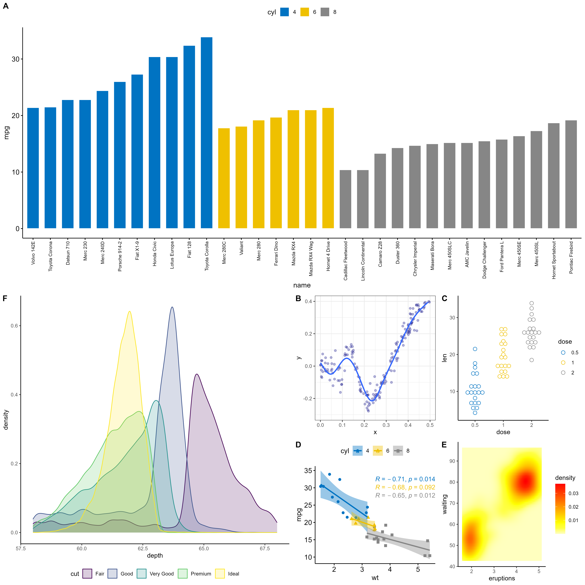
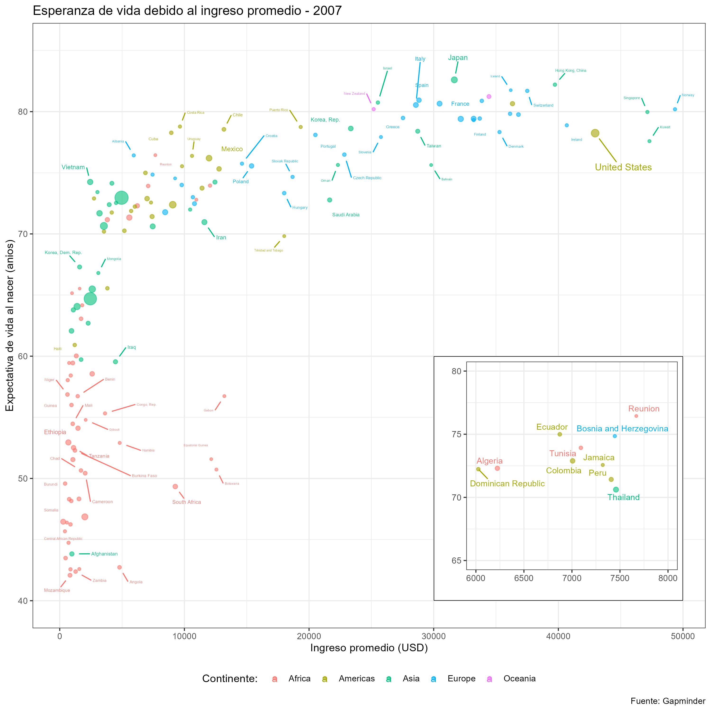

## Instrucciones

Utilice un documento tipo *.Rmd* o *.qmd* y genere un reporte *html.* Estos dos documentos (Rmd y html) guardelos con control de cambios en un repositorio de GitHub y **pegue solamente el enlace del repositorio** en esta entrega.

La entrega debe contener los códigos para obtener las siguientes figuras: 

## 1. Réplica de la figura compuesta.


Figura compuesta

```{r warning=FALSE, message=FALSE}
library("ggplot2")
library("dplyr")
library("ggpubr")

data(mtcars)
mtcars$name = rownames(mtcars)
mtcars$cyl = as.factor(mtcars$cyl)

# barplot por registro
p5 <- ggbarplot(mtcars, x = "name", y = "mpg", fill = "cyl",  
                color = "white",  palette = "jco", 
                sort.val = "asc", sort.by.groups = TRUE,
                x.text.angle = 90) + font("x.text", size = 8)

# densityplot
p7 <- ggplot(diamonds, aes(depth, fill = cut, colour = cut)) +
  geom_density(alpha = 0.2, na.rm = TRUE) + 
  xlim(58, 68) +  theme_classic() + theme(legend.position = "bottom")

#Gráfico zoom
set.seed(42)
n <- 1000
x <- runif(n) * 3
y <- x * sin(1/x) + rnorm(n) / 25

df <- data.frame(x = x, y = y)

p2 <- ggplot(df, aes(x, y)) + geom_point(alpha = 0.3, col = "navyblue") +
    geom_smooth(se = FALSE) + scale_x_continuous(limits = c(0, 0.5)) +
    scale_y_continuous(limits = c(-0.3, 0.4)) + theme_bw()

#Dotplot
p4 <- ggdotplot(ToothGrowth, x = "dose", y = "len",
                color = "dose", palette = "npg", binwidth = 1)+ theme_classic()

# scatterplot con regresión y ecuaciones
p6 <- ggscatter(mtcars, x = "wt", y = "mpg", add = "reg.line", conf.int = TRUE,
               color = "cyl", palette = "jco", shape = "cyl") +
  stat_cor(aes(color = cyl), label.x.npc = "centre", label.y.npc="top")

#Gráfico calor
p8 <- ggplot(faithfuld, aes(eruptions, waiting)) + 
  geom_raster(aes(fill = density)) + theme_classic() +
  scale_fill_gradientn(colours = heat.colors(10, rev = TRUE), na.value = "white")
  
multi = 
  ggarrange(p5, 
            ggarrange(p7,
                      ggarrange(p2, p4, p6, p8, ncol = 2, nrow = 2, 
                                labels = c("B", "C", "D", "E")),
                      ncol = 2, labels = "F")
            ,labels = "A", nrow = 2, common.legend = TRUE)

multi

```

## 2. Réplica de la figura embebida


Figura embebida

```{r warning=FALSE, message=FALSE}
library("ggplot2")
library("dplyr")
library("ggpubr")
library("ggrepel")

ruta <- "https://raw.githubusercontent.com/martintinch0/CienciaDeDatosParaCuriosos/master/data/gapminder.csv"
df_gapminder <- read.table(file = ruta, sep=';', header = TRUE, 
                           stringsAsFactors = FALSE)

df_g <- df_gapminder %>% 
  filter (year == 2007) 
  
esp1 =  
  ggplot(df_g,aes(x = gdpPercap, y = lifeExp, 
             size=pop, color=continent)) + 
  geom_point() + 
  geom_text_repel(aes(label=country), size = 1.5, 
                  max.overlaps = 10) +
  labs(x = "Ingreso promedio (USD)",
       y = "Expectativa de vida al nacer (años)",
       title="Esperanza de vida debido al ingreso promedio - 2007",
       caption="Fuente: Gapminder",
       color="Continente: ") +
  guides(size=FALSE) + 
  
  theme(legend.position="bottom", 
        legend.title = element_text(face = "bold", color = "black", size= 10), 
        panel.background = element_rect(fill = "white", colour = "grey80"), 
        panel.grid.major = element_line(colour = "grey90", linetype = "dotted"))
  
esp2 =
  ggplot(df_g, aes(x = gdpPercap, y = lifeExp, 
             size=pop, color=continent)) +
  geom_point() + 
  geom_text_repel(aes(label=country), size = 1.5) +
  scale_x_continuous(limits = c(6000, 8000)) +
  scale_y_continuous(limits = c(65, 80)) +
  guides(size=FALSE) + 
  
  theme(legend.position = "none",
        axis.title = element_blank(),
        legend.title = element_text(face = "bold", color = "black", size= 10), 
        panel.background = element_rect(fill = "white", colour = "grey80"), 
        panel.grid.major = element_line(colour = "grey90", linetype = "dotted"))

embeb = esp1 + annotation_custom(ggplotGrob(esp2), 
                                 xmin = 30000, xmax = 50000, 
                                 ymin = 40, ymax = 60)
embeb
  
```